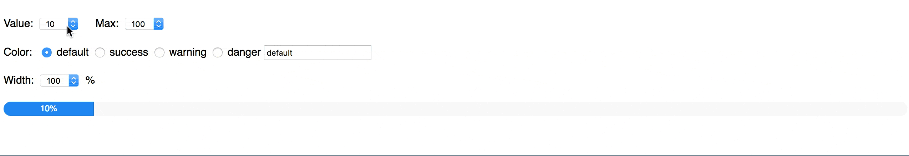

# uk-progress

It is a uikit progress component for vue.



## Installation

```
$ npm install --save uk-progress
```

## Usage

```
<!--
options: {
    value: Number,
    max: Number,
    color: String, ["default" or "success" or "warning" or "danger" or HEX value]
    width: String [e.g: "50%" or "200px"]
}
-->
<div id="app">
    <uk-progress value="20" max="100" color="default" width="50%"></uk-progress>
</div>
```

```
import Vue from "vue";
import UkProgress from "uk-progress";

Vue.component("uk-progress", UkProgress);
new Vue({
    el: "#app"
});
```

## Local test

1. Clone repository.

    ```
    $ git clone git@github.com:vue-kit/uk-progress.git
    ```

2. Install dependencies.

    ```
    $ npm install
    ```

3. Run test page with hot reload at localhost:8080.

    ```
    $ npm test
    ```
